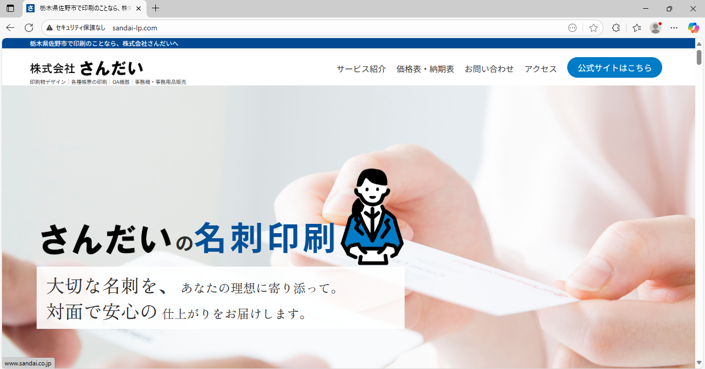
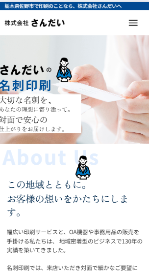
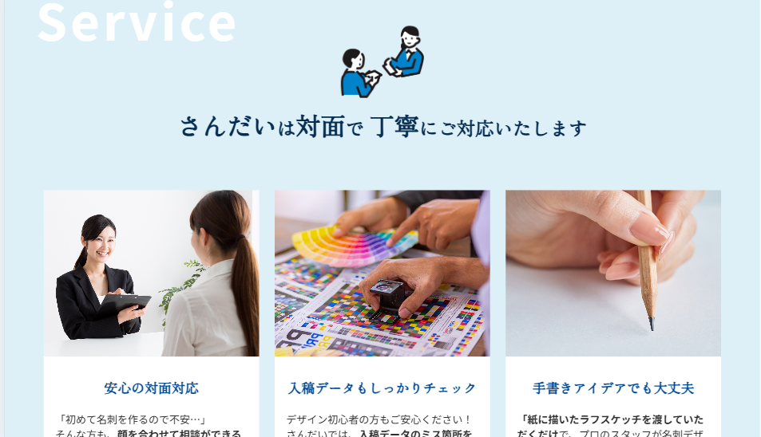

# sandai-lp
実家のOA機器販売・印刷物デザイン会社のLPを制作しました。デザインからコーディング、サーバー設定・公開まで一貫して担当。現在も公開運用されています。

## 使用技術
- HTML / CSS  
- JavaScript（ナビゲーション切り替えで使用）  
- サーバー設定（レンタルサーバー / ドメイン取得）

## 担当範囲
- 要件ヒアリング、情報設計（サイトマップ・ワイヤーフレーム）  
- デザイン（Figmaで制作）  
- コーディング（レスポンシブ対応）  
- サーバー・ドメイン設定、公開作業  

## ポイント
- PC/SP 両対応のデザインを制作  
- 基本的な JavaScript によるナビゲーション切り替えを実装

## サイトURL
[公開URLはこちら](http://sandai-lp.com/)

## プレビュー
メインビジュアル  

スマホ表示  

Serviceセクション  

## 制作期間
2025年8月（約4週間）
